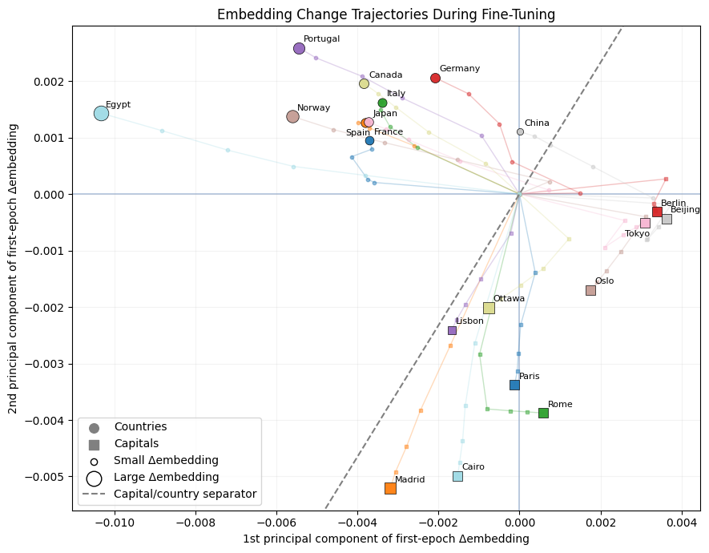

# Running and Fine-Tuning a Large Language Model on Your Laptop

Notebook for my **OpenSouthCode 2026** talk.

This repository contains the complete Jupyter notebook from the session, showing how to run, understand, visualize, and fine-tune a GPT-2 language model locally using Python and the Hugging Face Transformers library.

---

## 🚀 Run Online

Open and run the notebook directly in your browser using **Google Colab** (no installation required):

[](https://colab.research.google.com/github/AntonioFPerez/osc2026-local-llm/blob/main/osc2026_running_and_finetuning_llms_locally.ipynb)

<p align="center">
  
</p>

---

## Topics Covered

- Setting up the Python environment
- Loading a pretrained GPT-2 model
- Understanding the GPT-2 transformer architecture
- Exploring token embeddings
- Running text generation (LLM inference)
- Fine-tuning GPT-2 on a small dataset
- Visualizing embedding trajectories during fine-tuning
- References and further reading

---

## Running Locally

Clone the repository:

```bash
git clone git@github.com:AntonioFPerez/osc2026-local-llm.git
cd osc2026-local-llm
```

Then open the notebook using **JupyterLab**, **Jupyter Notebook**, or **Visual Studio Code**.

---

## About the Talk

**Running and Fine-Tuning a Large Language Model on Your Laptop**

Presented at **OpenSouthCode 2026**.

---

## Further Reading

1. **Sebastian Raschka**  
   *Build a Large Language Model (From Scratch)*  
   GitHub: https://github.com/rasbt/LLMs-from-scratch

2. **David N. Olivieri** and **Antonio F. Pérez Rodríguez**  
   *Transformer Field Theory: A Response-Theoretic Approach to Mechanistic Interpretability*  
   arXiv: https://arxiv.org/abs/2605.25225  
   ResearchGate: https://www.researchgate.net/publication/405263515_Transformer_Field_Theory_A_Response-Theoretic_Approach_to_Mechanistic_Interpretability

---

## License

This project is released under the MIT License.